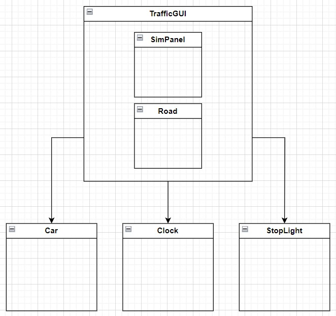
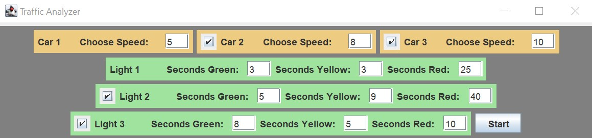
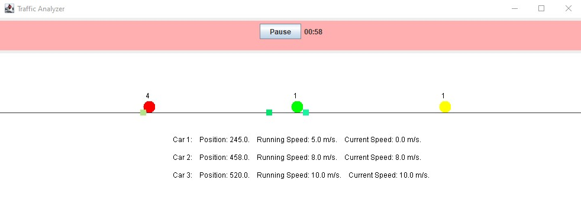

# Traffic Light Simulator

A multi-threaded car and traffic light simulator built with Java Swing. This project demonstrates Java concurrency, event handling, and GUI programming.

## Features
- Simulate up to 3 cars and traffic lights
- Adjustable car speed and traffic light cycles
- Pause/resume functionality

## Installation
1. Clone this repository
2. Open the project in a Java-compatible IDE
3. Compile and run `TrafficGUI.java`

## Usage
- Select the number of cars and traffic lights
- Adjust their behavior using the controls
- Pause and resume the simulation at any time

## Class Diagram

## Simulation Settings

## Running Simulator

## Contributing
Feel free to fork this repository and submit pull requests.

